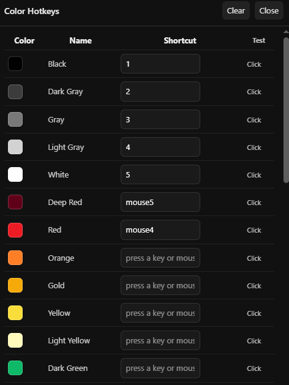

# WPlace Custom Key & Mouse Color Binder

A Tampermonkey userscript for [wplace.live](https://wplace.live) that allows you to bind colors to specific keys and mouse buttons (Mouse 4, Mouse 5, etc.).

## Features
- Bind colors to keyboard keys.  
- Bind colors to mouse buttons.  
- Fully customizable directly in the script.

## Installation
1. Install [Tampermonkey](https://www.tampermonkey.net/).  
2. Go to this repository and click on the `anayy_n-wplace-hotkeys.user.js` file.  
3. Click **Raw** to get the direct link.  
4. Tampermonkey will prompt you to install the script.

## Usage
1. Visit [wplace.live](https://wplace.live).  
2. In the bottom-right corner, you will see an icon called **Hotkeys**. Click it to open your color palette.  
3. If some colors are missing, fully expand the palette, and all options will appear in the UI.  
4. **Note:** If you don’t open the color palette, nothing will show up.

## Screenshot

